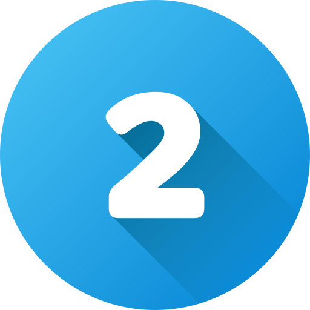

<br>


## &nbsp;FACTS ABOUT ME


- <code>🧞 An aspiring <FONT COLOR="009FBD">Full-Stack Web Developer</FONT></code>
- <code>🌱 Currently learning <FONT COLOR="D58BDD">Web Development</FONT></code>
- <code>👩🏻‍🎓 College Student Major in <FONT COLOR="59CE8F">Computer Science</FONT></code>
- <code>🏫 Studying at <FONT COLOR="F45050">Mapúa Malayan Colleges Laguna</FONT></code>
- <code>😄 Pronouns: <FONT COLOR="EE99A0">She/Her</FONT></code>
- <code>🌟 Interested in <FONT COLOR="CD5888">UI/UX Design</FONT> and <FONT COLOR="D58BDD"><br>Web Development</FONT></code>
- <code>⚡ Fun fact: <FONT COLOR="">...</FONT></code>

<br><br>

## &nbsp;&nbsp;Skills
<div>
    <p><b><FONT COLOR="D35D6E">&gt;&gt; Learned / Quite Familiar with:</FONT></b></p>
    <code><a href="https://www.python.org/" target="_blank"></a></code>
    <code><a href="https://www.w3schools.com/cs/index.php/" target="_blank"></a></code>
    <code><a href="https://www.w3schools.com/cpp/cpp_intro.asp" target="_blank"></a></code>
    <code><a href="https://www.w3schools.com/html/" target="_blank"></a></code>
    <code><a href="https://www.arduino.cc/" target="_blank"></a></code>
    <code><a href="https://www.canva.com/" target="_blank"></a></code>
    <code><a href="https://www.figma.com/" target="_blank"></a></code>
    <code><a href="https://code.visualstudio.com/" target="_blank"></a></code>
</div>
<br>
<div>
    <p><b><FONT COLOR="D35D6E">&gt;&gt; Looking forward to learn:</FONT></b></p>
    <code><a href="https://www.w3schools.com/css/" target="_blank"></a></code>
    <code><a href="https://www.javascript.com/" target="_blank"></a></code>
    <code><a href="https://www.adobe.com/products/photoshop.html" target="_blank"></a></code>
    <code><a href="https://www.adobe.com/ph_en/products/illustrator.html" target="_blank"></a></code>
    <code><a href="https://inkscape.org/" target="_blank"></a></code>
    <code><a href="https://git-scm.com/" target="_blank"></a></code>
</div>

<br>

## &nbsp;&nbsp;How to Contact Me
<code><a href="https://www.facebook.com/nmdandosay13/"></a></code>
<code><a href="https://www.hackerrank.com/profile/NoelaAndosay"></a></code>
<code><a href="https://github.com/NMAndosay"></a></code>

<br>

## GIT COMMAND CHEAT SHEET


```md
git clone git@github.com:example-user/example-repo.git
```
> [!IMPORTANT]\
> This command is used to clone a remote repository to your local machine. It's typically the first command you run when you want to start working on a project that already exists on a remote server (like GitHub).

> [!NOTE]\
> <b>Parameters</b>: <br>
> git@github.com:USER-NAME/REPOSITORY-NAME.git: The SSH URL of the remote repository.

<br>



```md
git add .
```
> [!IMPORTANT]\
> This command is used to stage <i>all the changes</i> in the current directory for the next commit. It prepares the changes to be committed.

> [!NOTE]\
> <b>Parameters</b>: <br>
> '.' Represents the current directory. It specifies that you want to add all changes in the current directory and its subdirectories.

<br>


```md
git commit -m "Add new feature"
```
> [!IMPORTANT]\
> This command is used to save the <i>staged changes</i> in the version history. The commit message should briefly describe the changes made in this commit.

> [!NOTE]\
> <b>Parameters</b>: <br>
> -m "your commit message": This flag allows you to add a commit message directly from the command line.

<br>


```md
git status
```
> [!IMPORTANT]\
> This command shows the <i>status of changes</i> as untracked, modified, or staged. It helps you understand the current state of your working directory.

> [!NOTE]\
> <b>Parameters</b>: <br> No additional parameters are needed for this command.

<br>


```md
git log
```
> [!IMPORTANT]\
>  This command displays a <i>log of all commits</i> in the repository, showing the commit history along with details such as author, date, and commit message.

> [!NOTE]\
> <b>Parameters</b>: <br> No additional parameters are needed for this command.

<br><hr><br>
