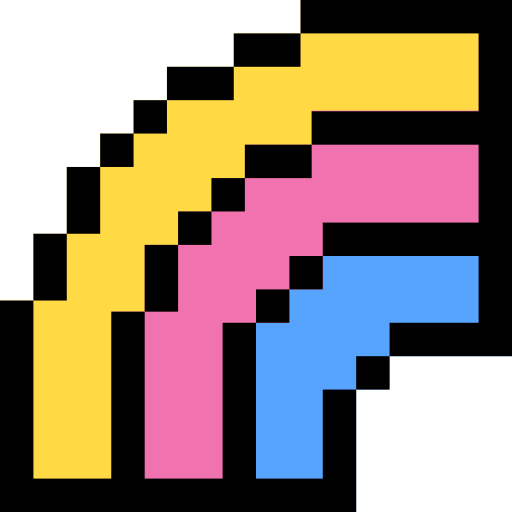
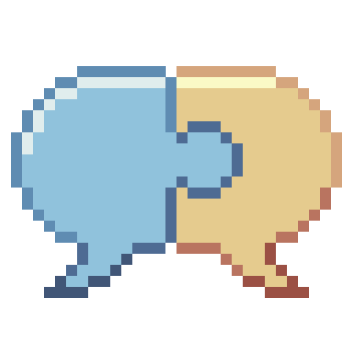
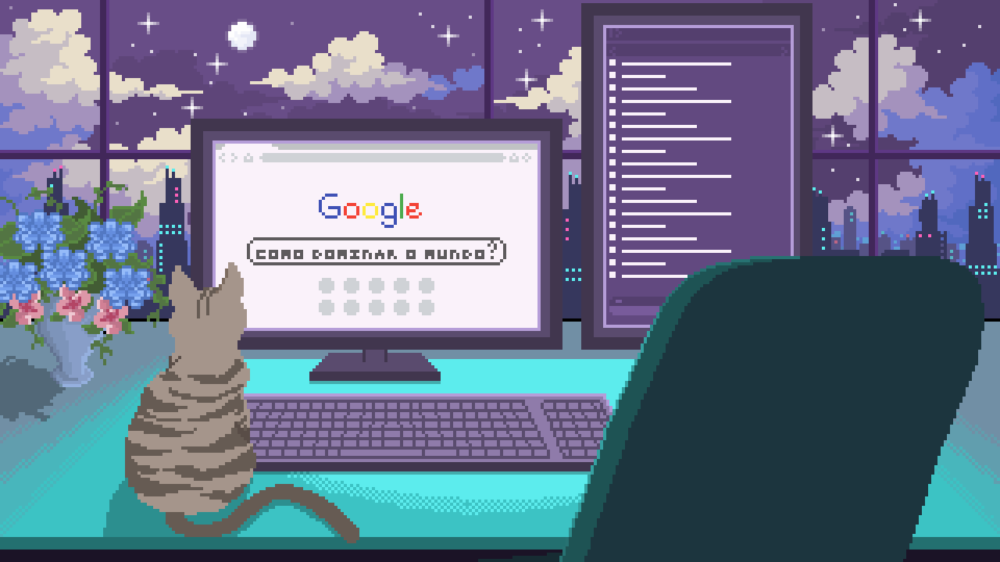

 

<!-- 🌸 Top Banner -->

  

 

<!-- ✦ Name -->
<h2 align="center">✦ 𝐇𝐢 𝐭𝐡𝐞𝐫𝐞! 🌸 𝐈’𝐦 𝐍𝐨𝐞𝐥𝐚 𝐌𝐚𝐞 𝐀𝐧𝐝𝐨𝐬𝐚𝐲 ✦</h2>

<!-- 🌷 Subtitle -->

  <i>aspiring data scientist · creative developer · UI/UX enthusiast</i>

𓂃𓈒𓏸 🌸 🌷 🌸 𓂃𓈒𓏸

##  &nbsp;FACTS ABOUT ME

- <code>👩🏻‍🎓 BS in Computer Science, specializing in Data Science and Analytics</code>
- <code>🏫 Mapúa Malayan Colleges Laguna</code>
- <code>😄 Pronouns: She / Her</code>
- <code>🌟 Interested in UI/UX Design, Web Development, and Data Science &amp; Analytics</code>

 

𓂃𓈒𓏸 🌸 🌷 🌸 𓂃𓈒𓏸

  

𓂃𓈒𓏸 🌸 🌷 🌸 𓂃𓈒𓏸

##  &nbsp;SKILLS

<b>>> Learned / Quite Familiar with:</b>

<!-- Programming Languages -->
<code></code>
<code></code>
<code></code>
<code></code>

<!-- Web Development -->
<code></code>
<code></code>
<code></code>

<!-- Data Science -->
<code></code>
<code></code>
<code></code>

<!-- Tools -->
<code></code>
<code></code>
<code></code>
<code></code>

<!-- Design -->
<code></code>

 

  

  

 

𓂃𓈒𓏸 🌸 🌷 🌸 𓂃𓈒𓏸

##  &nbsp;HOW TO CONTACT ME

  <code></code>
  <code></code>
  <code></code>

 

<!-- 🐱 Footer -->

  

  <i>Thanks for visiting my profile ✨</i>

  ૮꒰ ˶• ༝ •˶꒱ა ♡ see you around!

