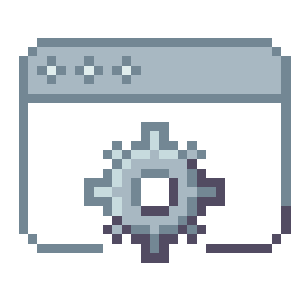

<br/>

<p align="center"><i>gif from <a href="https://www.terminalgif.com/">terminalgif.com</a></i></p>

## &nbsp;FACTS ABOUT ME


- <code>🧞 An aspiring Full-Stack Web Developer</code>
- <code>🌱 Currently learning Web Development</code>
- <code>👩🏻‍🎓 College Student Major in Computer Science</code>
- <code>🏫 Studying at Mapúa Malayan Colleges Laguna</code>
- <code>😄 Pronouns: She/Her</code>
- <code>🌟 Interested in UI/UX Design and <br/>Web Development</code>


<br />

## &nbsp;&nbsp;Skills
<p><b>&gt;&gt; Learned / Quite Familiar with:</b></p>
<div align="center">
    <code><a href="https://www.python.org/" target="_blank"></a></code>
    <code><a href="https://www.w3schools.com/cs/index.php/" target="_blank"></a></code>
    <code><a href="https://www.w3schools.com/cpp/cpp_intro.asp" target="_blank"></a></code>
    <code><a href="https://www.w3schools.com/html/" target="_blank"></a></code>
    <code><a href="https://www.arduino.cc/" target="_blank"></a></code>
    <code><a href="https://www.canva.com/" target="_blank"></a></code>
    <code><a href="https://www.figma.com/" target="_blank"></a></code>
    <code><a href="https://code.visualstudio.com/" target="_blank"></a></code>
</div>
<br/>
<p><b>&gt;&gt; Looking forward to learn:</b></p>
<div align="center">
    <code><a href="https://www.w3schools.com/css/" target="_blank"></a></code>
    <code><a href="https://www.javascript.com/" target="_blank"></a></code>
    <code><a href="https://www.adobe.com/products/photoshop.html" target="_blank"></a></code>
    <code><a href="https://www.adobe.com/ph_en/products/illustrator.html" target="_blank"></a></code>
    <code><a href="https://inkscape.org/" target="_blank"></a></code>
    <code><a href="https://git-scm.com/" target="_blank"></a></code>
</div>

<br/>

## &nbsp;&nbsp;How to Contact Me

<div align="center">
    <code><a href="https://www.facebook.com/nmdandosay13/"></a></code>
    <code><a href="https://www.hackerrank.com/profile/NoelaAndosay"></a></code>
    <code><a href="https://github.com/NMAndosay"></a></code>
</div>

<br/>

## &nbsp;&nbsp;GIT COMMAND CHEAT SHEET


```md
git clone git@github.com:example-user/example-repo.git
```

> [!IMPORTANT]\
> This command is used to clone a remote repository to your local machine. It's typically the first command you run when you want to start working on a project that already exists on a remote server (like GitHub).

> [!NOTE]\
> <b>Parameters</b>: <br/>
> git@github.com:USER-NAME/REPOSITORY-NAME.git: The SSH URL of the remote repository.
> <br><br><b>Example</b>: <code>git clone https://github.com/exampleuser/example-repository.git</code>

<br/>


```md
git add .
```

> [!IMPORTANT]\
> This command is used to stage <i>all the changes</i> in the current directory for the next commit. It prepares the changes to be committed.

> [!NOTE]\
> <b>Parameters</b>: <br/>
> '.' Represents the current directory. It specifies that you want to add all changes in the current directory and its subdirectories.
> <br><br><b>Example</b>: <code>git add .</code>

<br/>


```md
git commit -m "Add new feature"
```

> [!IMPORTANT]\
> This command is used to save the *staged changes* in the version history. The commit message should briefly describe the changes made in this commit.

> [!NOTE]\
> <b>Parameters</b>: <br/>
> -m "your commit message": This flag allows you to add a commit message directly from the command line.
> <br><br><b>Example</b>: <code>git commit -m "Add and modify files"</code>

<br/>


```md
git status
```

> [!IMPORTANT]\
> This command shows the <i>status of changes</i> as untracked, modified, or staged. It helps you understand the current state of your working directory.

> [!NOTE]\
> <b>Parameters</b>: <br/> No additional parameters are needed for this command.
> <br><br><b>Example</b>: <code>git status</code>

<br/>


```md
git log
```

> [!IMPORTANT]\
>  This command displays a <i>log of all commits</i> in the repository, showing the commit history along with details such as author, date, and commit message.

> [!NOTE]\
> <b>Parameters</b>: <br/> No additional parameters are needed for this command.
> <br><br><b>Example</b>: <code>git log</code>

<br>

<h1> Additional Commands </h1>
<h2>1. 'git checkout'</h2>

```md
git checkout branch_name
```

> [!IMPORTANT]\
>  The purpose of this command is to switch branches or restore working tree files.

> [!NOTE]\
> <b>Parameters</b>: <br/> 'branch_name': name of the branch you want to switch to <br> '-b <new_branch>': creates a new branch and switches to it <br> '<commit_hash> -- <file>: restores a specific file from a particular commit.

<h2>2. 'git pull'</h2>

```md
git pull origin main
```
> [!IMPORTANT]\
>  The purpose of this command is to fetch changes from a repository and merges them into the local branch.

> [!NOTE]\
> <b>Parameters</b>: <br/> 'origin': name of the remote repository. <br> 'main': name of the branch from which changes are fetched and merged.


<br />
<hr><br />
