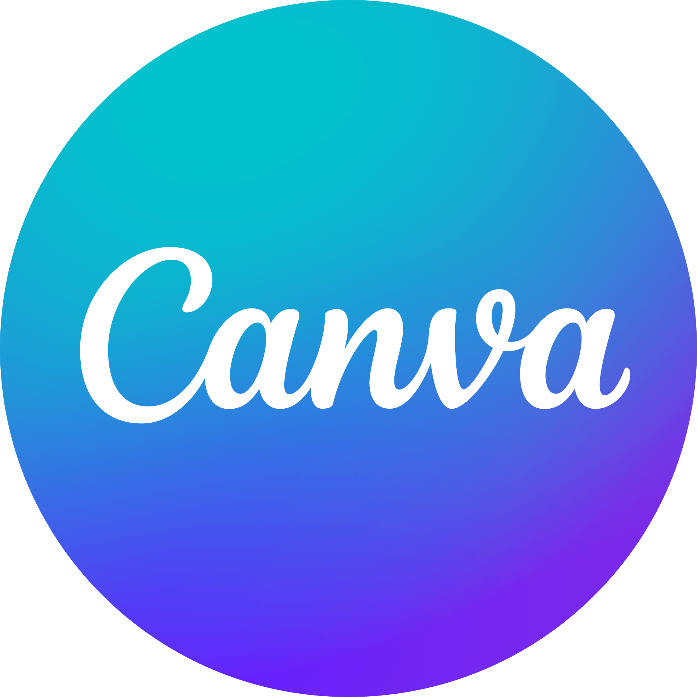

 

 

<h2 align="center">Hi! I am Noela Mae Andosay</h2>

 

## &nbsp;FACTS ABOUT ME

- <code>🧞 An aspiring Data Scientist</code>
- <code>👩🏻‍🎓 College Student Major in Computer Science</code>
- <code>🏫 Studying at Mapúa Malayan Colleges Laguna</code>
- <code>😄 Pronouns: She/Her</code>
- <code>🌟 Interested in UI/UX Design and  Web Development</code>

 

## &nbsp;&nbsp;Skills

<b>&gt;&gt; Learned / Quite Familiar with:</b>

    <code></code>
    <code></code>
    <code></code>
    <code></code>
    <code></code>
    <code></code>
    <code></code>
    <code></code>

 

<b>&gt;&gt; Looking forward to learn:</b>

    <code></code>
    <code></code>
    <code></code>
    <code></code>
    <code></code>
    <code></code>

 

## &nbsp;&nbsp;How to Contact Me

    <code></code>
    <code></code>
    <code></code>

 
